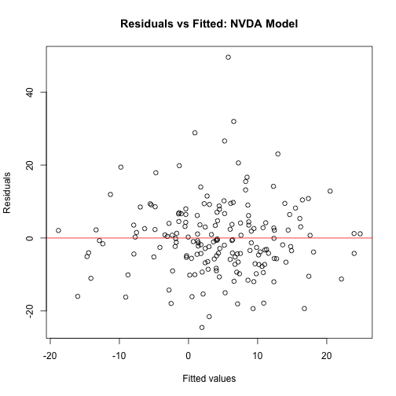
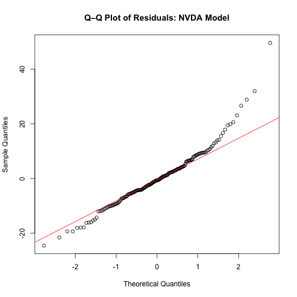

# Modeling NVIDIA's Excess Returns

An extended Fama–French factor model for NVIDIA's monthly excess returns, estimated over 189 observations from February 2010 to October 2025, with a full battery of OLS diagnostics — including the one the model fails.

---

## The question

NVIDIA is the obvious stock to ask a factor model about. It spent fifteen years as a high-beta semiconductor firm and then became the defining asset of the AI trade. The question I wanted to answer was whether its returns are explained by ordinary systematic risk factors, or whether something structural changed — and if the standard three-factor model is insufficient, *what specifically* it fails to capture.

The point of the exercise was not to find a model that fits. It was to test one properly and report what the tests said.

## Approach

Two models, estimated in sequence:

**1. Benchmark — Fama–French 3-factor** (`R/01_ff3_benchmark.R`)

```
excess_nvda ~ Mkt_RF + SMB + HML
```

The standard specification, estimated first so the extended model has something to be compared against rather than being judged on its own.

**2. Extended specification** (`R/02_extended_model.R`)

```
excess_nvda ~ Mkt_RF + HML + vix_chg + AI_boom
```

SMB is dropped (size offers little explanatory power for a firm of NVIDIA's scale). Two variables are added: the **monthly change in the VIX**, to test sensitivity to shifts in market volatility rather than its level, and an **AI boom dummy** set to 1 from January 2020 onward, to test for a structural break.

**Data** is assembled from three sources at runtime, not vendored: NVIDIA adjusted closes and the VIX from Yahoo Finance via `quantmod`, and the U.S. research factors from Kenneth French's data library. Monthly log returns, excess of the risk-free rate.

## Results

**Table 1 — OLS estimates, NVIDIA monthly excess returns (2010–2025)**

| Variable | Estimate | Std. Error | t | p |
|---|---:|---:|---:|---:|
| Intercept | −0.434 | 0.923 | −0.47 | 0.639 |
| `Mkt_RF` | **2.333** | 0.259 | 9.01 | <0.0001 |
| `HML` | **−0.864** | 0.215 | −4.03 | <0.0001 |
| `vix_chg` | **0.672** | 0.213 | 3.15 | 0.0019 |
| `AI_boom` | 2.653 | 1.446 | 1.84 | 0.0681 |

**Table 2 — Fit**

| Statistic | Value |
|---|---:|
| R² | 0.423 |
| Adjusted R² | 0.411 |
| Residual std. error | 9.59 |
| F-statistic | 33.7 (p < 0.001) |
| Observations | 189 |

### Interpretation

- **Market beta of 2.33** — a 1 percentage point rise in the market excess return is associated with a 2.33 point rise in NVIDIA's. The stock carries more than twice the market's systematic risk, which is what the high-beta semiconductor characterisation predicts.
- **HML of −0.864** — significantly negative, confirming NVIDIA loads on growth rather than value.
- **`vix_chg` of +0.672** — positive and significant, which is the counterintuitive result. NVIDIA's excess returns rise with *increases* in volatility, rather than falling as a conventional risk story would predict.
- **`AI_boom` of +2.653** — an estimated 2.65 points of additional monthly excess return post-2020, but significant only at the 10% level (p = 0.068). **This does not clear a 5% threshold and should not be reported as though it does.**

## Diagnostics

| Test | Statistic | Critical value | Result |
|---|---:|---:|---|
| Breusch–Pagan (heteroskedasticity) | 2.00 | 9.49 | Pass — fail to reject |
| Breusch–Godfrey (autocorrelation) | 2.00 | 3.84 | Pass — fail to reject |
| Variance inflation factors | all < 5 | 5 | Pass — no multicollinearity |
| **Ramsey RESET (functional form)** | **F = 3.00** | **2.02** | **FAIL — reject; misspecified** |

**The model fails the RESET test.** Errors are well-behaved — homoskedastic, serially uncorrelated, no collinearity problem — but the functional form is wrong. There are omitted variables or unmodelled non-linearity, which is unsurprising when four regressors are asked to explain a stock driven by product cycles, supply constraints, competition, and sentiment.

I attempted a remediation by adding a squared market term (`Mkt_RF²`) and re-running the diagnostics. It is in `R/02_extended_model.R` as `model_sq`. It did not resolve the misspecification, and I report the original model rather than quietly substituting the one with an extra term.




## What I learned

- **A model that passes three tests and fails the fourth is a failed model, and saying so is the job.** Adjusted R² of 0.411 on a single volatile equity is a respectable fit, and it would have been easy to lead with that and mention RESET in a footnote. The honest summary is that the specification is misspecified and the fit statistic does not redeem it. Deciding to report it that way was the most useful thing this project taught me.
- **Significance thresholds have to be fixed before you see the p-value.** The `AI_boom` coefficient at p = 0.068 was the result I most wanted to be real — it is the interesting finding, the one the whole extension was built to test. It does not clear 5%. Having committed to the threshold in advance is the only reason that was a straightforward call.
- **Diagnostics are the analysis, not a postscript.** I originally treated the tests as a box-ticking step after the "real" work of estimation. They turned out to be the only part that told me something I did not already believe — the coefficients largely confirmed my priors, and the RESET result was the one genuine surprise.
- **Reproducibility is fragile in ways that are invisible until you re-run.** An early version of this analysis broke on two things that had nothing to do with econometrics: a ticker symbol needing different handling, and a filename inside a remote zip archive changing case. Anything pulling live data from third-party sources needs to be re-runnable from scratch to be trusted, and that means the failures surface at run time rather than silently producing a stale result.

## Why it mattered

This is the piece of work where I learned what it means to be accountable to a result rather than to a narrative. The findings are genuinely interesting — a 2.33 beta, a significant negative value loading, a counterintuitive positive volatility coefficient — and the model still fails a specification test that I am obliged to report. Holding both of those at once, and not letting the interesting part quietly bury the inconvenient part, is the habit I took from it.

## Running it

Requires R with:

```r
install.packages(c("quantmod","dplyr","lubridate","zoo","pastecs",
                   "ggcorrplot","lmtest","sandwich","car"))
```

```r
source("R/01_ff3_benchmark.R")   # Fama-French 3-factor benchmark
source("R/02_extended_model.R")  # extended model + full diagnostics
```

Both scripts download data at run time from Yahoo Finance and the Kenneth French data library, so results will extend as new months become available and will not reproduce the table above exactly. The figures and tables here reflect the sample ending October 2025.

## Limitations

- **The model is misspecified** by the Ramsey RESET test. Stated at the top of this section because it is the single most important caveat.
- **`AI_boom` is not significant at 5%.** Any statement about a post-2020 structural break is suggestive, not established.
- **A January 2020 break date is a judgment call**, not an estimated changepoint. A Chow test or a data-driven break estimator would be the rigorous approach.
- **Single-asset OLS.** No panel structure, no time-varying beta, no GARCH treatment of volatility clustering — all of which are plausible reasons the functional form fails.
- **Live data dependency.** Re-running produces a different sample window and therefore different estimates.

## License

MIT — see [LICENSE](LICENSE).
